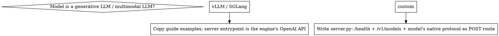

# Building Custom Model Servers (OICM)

## Overview

Package any HF/custom model as an OICM-compatible server: a small FastAPI app +
`startup.sh` + one Dockerfile per hardware target, validated against the platform
contract before push. The reference repo examples cover LLMs and vLLM/SGLang;
**everything else needs a custom `server.py`** following the same contract.

## The contract (every item is hard)

| OICM requirement | Implementation |
|---|---|
| Listen on port `8080` | fixed in `startup.sh` → server entry, never configurable |
| Non-root UID `10000` | `useradd --uid 10000 runner`, `USER runner`, `passwd -l root` |
| Model from `$PVC_PATH` | resolve in `startup.sh` (logic below), never bake into image |
| `MODEL_ID` on `/v1/models` | read env at runtime; echo it in every inference response |
| `/health` probe | bind immediately, answer 200 always (see Health section) |

## Decide: engine vs custom server

Wheels/images differ per target, so classify first:

| Target | Base image | torch install |
|---|---|---|
| GPU CUDA 13 (min 12.9) | `nvidia/cuda:13.0.0-runtime-ubuntu24.04` + apt `python3.12-venv` | `--index-url https://download.pytorch.org/whl/cu130` |
| CPU amd64+arm64 | `python:3.12-slim-bookworm` (multi-arch) | `--index-url https://download.pytorch.org/whl/cpu` — never default PyPI (pulls CUDA weights) |

**Before pinning torch**, verify the wheel exists for your python/platform:
`curl -s https://download.pytorch.org/whl/cu130/torch/ | grep -oE "torch-X.Y.Z\+cu130-cp312-[^\"<#]*x86_64"` (and `cpu`…`aarch64`). Wheels are also on the CPU image for arm64 — don't assume. GPU images build on linux/amd64 only.

## server.py design

- **Health**: bind the port the instant the process starts; load checkpoints in a
  **background thread**. `/health` returns 200 immediately with a `loaded` list and
  `detail` error field; a lazy, locked loader keeps requests correct if they arrive
  before preload finishes. Loading before binding = pod killed by probes before
  the port opens.
- **Inference**: expose the model's native protocol (e.g. `POST /v1/systemone`) and a
  minimal `/v1/chat/completions` shim if OpenAI-shaped clients must work. Map the
  request `model` field: `MODEL_ID` → auto/route; unknown ids → ignore-and-route.
- Async endpoints must read the body with `await request.json()` and run blocking
  inference through `starlette.concurrency.run_in_threadpool` — never
  `asyncio.run(request.json())` inside endpoints (loop-bound streams).
- With `from __future__ import annotations`, FastAPI resolves annotations against
  **module globals** — import `Request` at module top level, not inside the `create_app`
  closure, or the param is silently treated as a query arg (`Field required`).
- Errors: invalid body → 400, model/tokenizer errors → 422, wrong id → 404, optional
  `LAYA`/API-key bearer → 401. Surface initialisation failures in `/health.detail`.

## startup.sh

Use `#!/bin/bash` with `set -euo pipefail` and copy the guide's path logic verbatim —
but guard **every** platform env with `${VAR:-}` (`INIT_CONTAINER_USE_PVC`,
`USE_DATA_VOLUME` might be unset; `set -u` otherwise kills the container at line 1).
Exit non-zero with a clear message when `MODEL_ID` is unset. Resolve:

- `USE_DATA_VOLUME=True` → `$PVC_PATH`
- else → `$PVC_PATH/app/download/base_model` (honor `MODEL_DOWNLOAD_FOLDER`, `INIT_CONTAINER_USE_PVC`)
- `exec python /app/server.py` — `exec` so PID 1 handles signals.

## Model-dir discovery

The PVC layout varies: full bundle snapshot, a standalone checkpoint dir, or a
subfolder one level down. Discover by probing for the model's signature files
(e.g. `rl_agent_config.json` + `model.safetensors`) at the root, in known subfolders,
then one level of children (prefer a `base_model`-named child if ambiguous). Fail with
a message naming what was expected and where it looked. An optional HF download
fallback (`LAYA_ALLOW_DOWNLOAD=1` + `LAYA_HF_REPO`) makes local runs work without a PVC;
it must never trigger when the platform mount exists.

## Validation gate (run before push — all of it)

1. `docker build --check -f /Dockerfile .` — catches legacy `ENV k v` warnings.
2. Build CPU (`-t …`) locally; GPU image: `--check` only unless on a CUDA host.
3. `docker run … && docker exec <c> id` → must print `uid=10000`.
4. Health within ~seconds of start (wait-for-port loop, not a fixed `sleep`):
   `curl /health` → 200; `curl /v1/models` → `"id": $MODEL_ID`; unknown id → 404.
5. Real E2E inference with actual weights: pin both env modes
   (`USE_DATA_VOLUME=True` and default → `app/download/base_model`) via bind mounts.
6. Error paths: malformed questions → 422, missing field → 400, auth → 401.
7. Multi-arch: `docker buildx build --platform linux/amd64,linux/arm64 … --push`
   (multi-arch cannot `--load` locally; test amd64 via QEMU minimum).

## Common mistakes

| Mistake | Fix |
|---|---|
| Container exits: `INIT_CONTAINER_USE_PVC: unbound variable` | `${VAR:-}` everywhere under `set -u` |
| `curl` fails right after `docker run` | startup race — poll until port answers |
| `/health` blocks until model loads; pod restart-loops | bind immediately, preload in background thread |
| FastAPI `Field required` on `request: Request` | import `Request` at module level (annotation eval is module-global) |
| 1.4GB CPU image suddenly 4GB+ | you installed torch from default PyPI; use the `cpu` wheel index |
| torch pin fails to resolve on arm64/cu130 | verify wheel exists first (curl the index) |
| `ENV HOME /home/runner` warnings | modern `ENV HOME=/home/runner` format |
| image works locally, dies on platform | model baked into image instead of `$PVC_PATH`, or `MODEL_ID` unset — both are mounted/injected per deployment |
